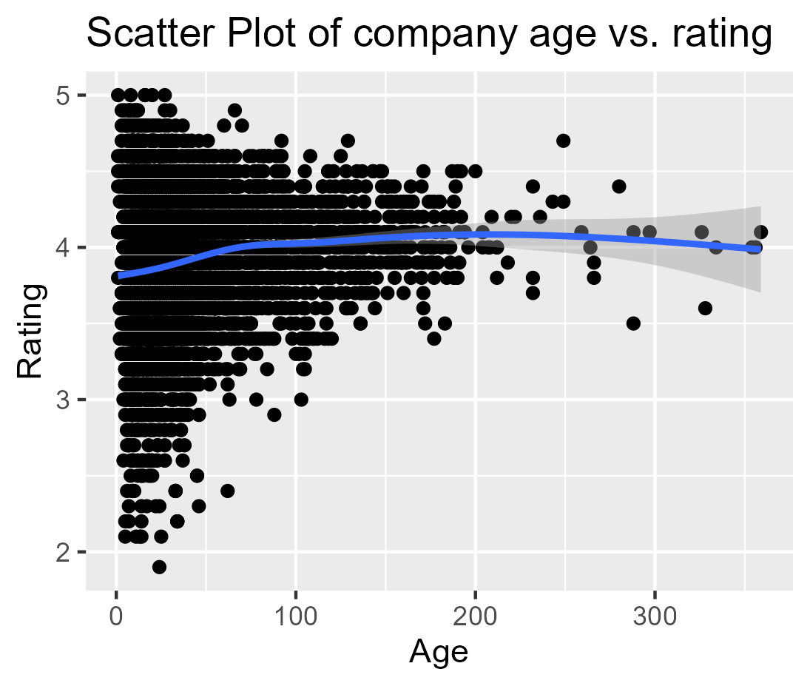
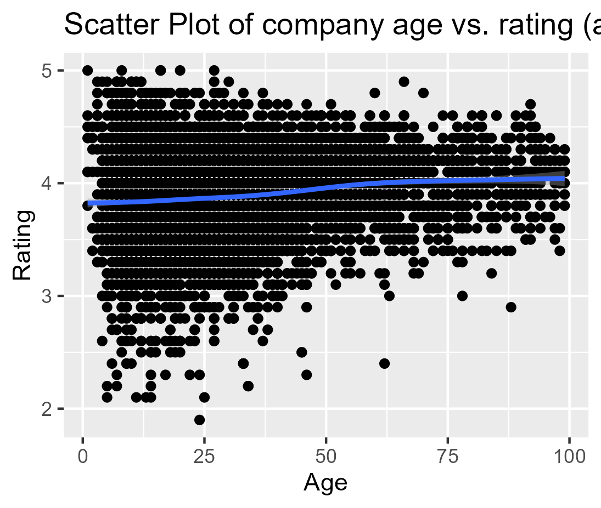

# Research Question

Are older companies more likely to be better rated than young enterprises?

# Empirical Hypothesis

Older companies are better established in the market and have more loyal customers. Therefore, older companies are more likely to be better rated than younger firms.

# Test of the empirical hypothesis

## Plotting and tidying the variables

First we created a plot visualising the distribution of the ratings across the age of the companies, the metric variable "age" on the x-axis and the categorical variable "rating" on the y-axis.

Creating it we realised that there are a lot of NAs, so we removed them in a separate 02_tidy data.R script. Then we plotted the data again in the 03_Plot_rating_age.R script. We saw that there are 6 companies that have an age of 2024 years. After further research, we noticed that the companies were founded in different years, so we removed them as well.

Companies are already well established after 100 years, that's why we created a second plot with companies below 100 years.

## Statistical Test

To make a statistical test we created linear models in the 04_Linear_model.R script for companies below 400 and one for all companies below 100 years.

Looking at the first model we can see that with every additional year the rating of a company increases by 0.0017988 and in the second model by 0.002921.

# Conclusion

The results of the statistical tests show that older companies are more likely to have a higher rating. Even though the coefficients seem relatively low, the effect is still visible, due to the small unit size of the independent variable "age" in years. The results are statistically significant and therefore support our empirical hypothesis.
